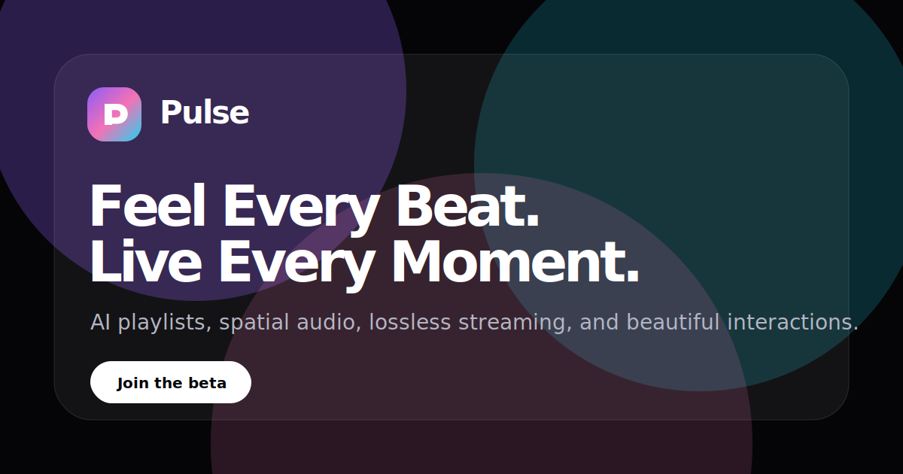

# Pulse — AI Music Streaming Platform

**Feel Every Beat. Live Every Moment.**

Pulse is a premium AI-powered music streaming platform designed for immersive listening. It combines lossless audio, AI-generated playlists, spatial sound, collaborative listening, and beautiful interactions into one modern experience.

This landing page is built as a polished 2026 startup product showcase inspired by Apple Music, Spotify, Linear, Vercel, and Nothing — with a premium dark UI, glassmorphism, cinematic motion, and music-first interactions.



## Highlights

- Premium floating glass navbar
- Cinematic full-screen hero with the Pulse tagline
- Animated glassmorphism music player
- Trending albums infinite carousel
- Magic Bento features section
- Interactive AI playlist generator simulation
- Circular artist showcase gallery
- Auto-scrolling testimonials
- Pricing section with monthly/yearly toggle
- Accessible FAQ accordion
- Aurora-powered footer with newsletter signup
- Custom 404 page
- Open Graph and Twitter card metadata
- Responsive desktop, tablet, and mobile layouts
- Reduced-motion support
- Lazy-loaded below-the-fold sections
- Section-level error boundaries

## Tech Stack

- React
- Vite
- TypeScript
- Tailwind CSS
- Framer Motion
- Lenis
- Lucide React
- React Bits-inspired local adapters
- ESLint
- Prettier

## Getting Started

### Prerequisites

Use Node.js 20 or newer.

```bash
node --version
```

### Install dependencies

```bash
npm install
```

### Start development server

```bash
npm run dev
```

### Typecheck

```bash
npm run typecheck
```

### Lint

```bash
npm run lint
```

### Format

```bash
npm run format
```

### Production build

```bash
npm run build
```

### Preview production build

```bash
npm run preview
```

## Project Structure

```txt
src/
├── app
│   ├── App.tsx
│   ├── error-boundary.tsx
│   ├── loading-screen.tsx
│   ├── page-transition.tsx
│   ├── providers.tsx
│   └── section-loader.tsx
├── assets
├── components
│   ├── motion
│   ├── react-bits
│   └── ui
├── constants
├── hooks
├── layouts
├── lib
├── sections
├── styles
└── types
```

## Key Sections

```txt
Hero
Trending Albums
Features
AI Playlist Generator
Artist Showcase
Testimonials
Pricing
FAQ
Footer
```

## Screenshots

Add screenshots or screen recordings here for your portfolio.

Recommended captures:

```txt
public/screenshots/desktop-hero.png
public/screenshots/mobile-hero.png
public/screenshots/features-bento.png
public/screenshots/ai-generator.png
public/screenshots/pricing.png
```

Example Markdown:

```md


```

## SEO and Social Sharing

The project includes Pulse-branded SEO and social metadata:

```txt
Title:
Pulse — AI Music Streaming Platform

Description:
Experience the future of music with Pulse. Discover AI-powered playlists, immersive spatial audio, lossless streaming, and a beautifully crafted listening experience.

Keywords:
AI Music, Music Streaming, Pulse, Playlist Generator, Spatial Audio, Premium Music, React, Frontend Showcase
```

Included assets:

```txt
index.html
public/favicon.svg
public/apple-touch-icon.svg
public/og-image.svg
public/site.webmanifest
public/404.html
404.html
```

Before publishing, update the canonical URL and social URLs in `index.html` and `src/constants/site.ts`.

## Performance Notes

Pulse is optimized for production:

- Below-the-fold sections are lazy-loaded
- Lazy section boundaries are isolated with error boundaries
- Repeated cards are memoized
- Images include width/height metadata
- Below-the-fold images use lazy loading
- Motion is transform/opacity-first
- Lenis smooth scrolling is initialized once
- Reduced-motion preferences are respected

## Accessibility Notes

Implemented accessibility foundations:

- Semantic landmarks
- Skip-to-content link
- Keyboard-accessible navbar and mobile menu
- Accessible FAQ accordion
- Accessible carousel controls
- Visible focus states
- ARIA labels for icon-only buttons
- Reduced-motion support
- Semantic pricing comparison table

## Deployment

Pulse can be deployed to Vercel, Netlify, or GitHub Pages.

For Vercel:

```bash
npm run build
```

Use the default Vite output directory:

```txt
dist
```

For GitHub Pages, ensure your deployment workflow publishes `dist` and preserves `404.html` for SPA-friendly fallback behavior.

## Portfolio Positioning

Pulse is designed to showcase:

- Senior-level React architecture
- Premium UI/UX polish
- Motion design discipline
- Accessibility awareness
- Production performance thinking
- Component-driven frontend development
- A cohesive 2026 startup landing page identity

## License

This project is intended for portfolio and educational use. Replace dummy content, imagery, and URLs before using it for a real commercial product.
